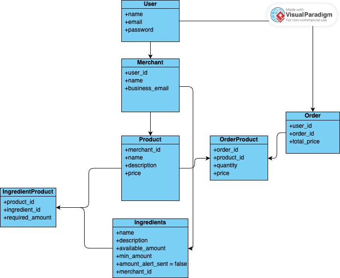

# Foodcis Coding Task
This is the implementation of Foodics coding task

## Task Description

> A system that has three main models; Product, Ingredient, and Order.
> A Burger (Product) may have several ingredients:
>  150g Beef
>  30g Cheese
>  20g Onion
> The system keeps the stock of each of these ingredients stored in the database. You
> can use the following levels for seeding the database:
> 20kg Beef
> 5kg Cheese
> 1kg Onion

> When a customer makes an order that includes a Burger. The system needs to update the
> stock of each of the ingredients so it reflects the amounts consumed.
> Also when any of the ingredients stock level reaches 50%, the system should send an
> email message to alert the merchant they need to buy more of this ingredient.
> Requirements:
> First, Write a controller action that:
> Accepts the order details from the request payload.
> Persists the Order in the database.
> Updates the stock of the ingredients.

> Second, ensure that en email is sent once the level of any of the ingredients reach
> below 50%. Only a single email should be sent, further consumption of the same
> ingredient below 50% shouldn't trigger an email.

> Finally, write several test cases that assert the order was correctly stored and the
> stock was correctly updated.

> The incoming payload may look like this:
```
{
    "products": [
        {
            "product_id": 1,
            "quantity": 2
        }
    ]
}
```

### Implementation ERD


### Requirements
- PHP 8.x
- Composer
- Laravel 10.x
- MySQL 

### Installation
### Docker
- Clone the Repo
- `cd` to the project folder
- Add alias to sail `alias sail='[ -f sail ] && sh sail || sh vendor/bin/sail'`
- `cp .env.example .env`
- Set the email server credentials in .env file
- Install the dependencies
```
docker run --rm \
    -u "$(id -u):$(id -g)" \
    -v "$(pwd):/var/www/html" \
    -w /var/www/html \
    laravelsail/php82-composer:latest \
    composer install --ignore-platform-reqs
``` 
- Start the project `sail up` it uses port 3316 for mysql and 8001 for the server, make sure they are available
- Run the migrations `sail artisan migrate`
    - Do the following only if you faced Database Connection Refused Error from the above command
        - run `docker network inspect bridge`
        - take the value from `IPAM.Config.Gateway` and replace it with `DB_HOST` in `.env` file
- Run the seeders `sail artisan db:seed`
- run the queue worker to enable email service `sail artisan queue:work`
- Run the test cases `sail artisan test`

### Local machine installation
- Clone the Repo
- `cd` to the project folder
- Install the dependencies `composer install`
- Set your env vars: 
    - Database credentials
    - Email server credentials
- Start the server `php artisan serve`
- Run the migrations `php artisan migrate`
- Run the seeder `php artisan db:
- run the queue worker to enable email service `php artisan queue:work`
- Run the test cases `php artisan test`

 
### Covered Test Cases
- Create a valid order
- Create order while there're no sufficient ingredient amounts
- Create order with invalid request body
- Email sent to the merchant when an ingredient amount reaches its minimum (set to 50% of the seeded data)
- No email will be sent after the first alert, on the same ingredient
- Ingredient updated event (the event responsible of sending the alert email) is dispatched correctly
 
 
***
***Seeded user credentials***
email: test@example.com
password: password
